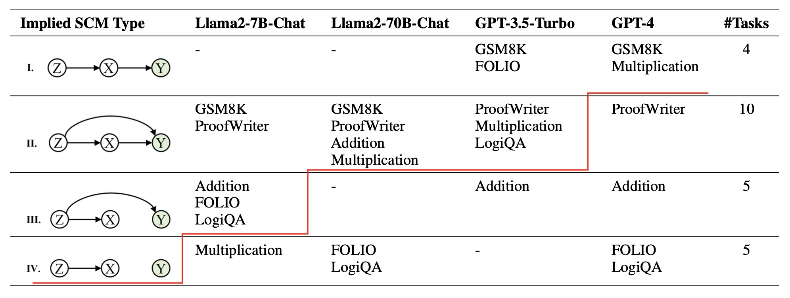

# CoT_Causal_Analysis

## 📚 Introduction
This is the repository for paper *[LLMs with Chain-of-Thought Are Non-Causal Reasoners](https://arxiv.org/abs/2402.16048)*.
We explores the role of the Chain of Thought (CoT) in Large Language Models (LLMs) reasoning, specifically:
-  We assess the significance of the cause-effect relationship between CoT and answers across various tasks to unveil the Structural Causal Model (SCM) that LLMs emulate.
-  We investigate the factors influencing the causal structure of the implied SCM across several distinct tasks.

<div align=center>

</div>

## ⚙️ Running the code
### Datasets
In this study, we carefully selected datasets and tasks to benchmark arithmetic and logical reasoning performance. Here's an overview of the datasets and tasks used:
- [Addition](./data/Addition): Generated datasets for 6-digit and 9-digit numbers, with each category comprising 500 samples.
- [Multiplication](./data/Addition/): Created datasets for 2-digit and 3-digit numbers, also with 500 samples per category.
- *[GSM8K](https://github.com/openai/grade-school-math)*: A collection of grade-school math word problems, from which we randomly selected 500 samples from the test set.
- *[ProofWriter](https://allenai.org/data/proofwriter)*: Focuses on deductive logical reasoning, with 600 instances chosen from the 5-hop-reasoning development set.
- *[FOLIO](https://github.com/Yale-LILY/FOLIO)*: Another dataset dedicated to deductive logical reasoning, utilizing all 204 instances from the development set.
- *[LOGIQA](https://github.com/csitfun/LogiQA2.0)*: Contains verbal reasoning exam questions. We randomly selected 600 entries from the LogiQA 2.0 test set.

All datasets have undergone preprocessing and are located within the `./data` folder. The corresponding prompts for each experimental setting are stored in the `./prompts` folder.
To generate data for arithmetic problems automatically, execute:
```bash
bash make_data.sh
```

### Prequsites
Begin by installing the necessary packages:
```bash
pip install -r requirements.txt
```

### Evaluate the task performance
To assess performance on the selected tasks, execute the following commands. This will run the code and save the results:

```bash
export api_key=sk_xxxxxxxxxx # your OpenAI API key
bash api_run.sh {MODEL} {TASK} {PROMPT}
```
- `MODEL`: Specify the model name, options include ['gpt-3.5-turbo', 'gpt-4', ...].
- `TASK`:  Define the task name, choices are [Addition:6, Addition:9, Product:2, Product:3, GSM8K, LOGIQA, FOLIO, ProofWriter].
- `PROMPT`: Choose the prompt setting, options range from [direct, cot0shot, cot4shot, ...].

### Check the correctness of CoT
For arithmetic problems, CoT correctness can be automatically verified using:
```bash
bash check.sh
```
For other tasks, correctness is manually checked.

### Intervene in the Random Variables
To investigate the outcomes affected by intervening in the random variables, use the commands below:
```bash
bash interfere.sh {MODEL} {TASK} {PROMPT} {DO_REASON} {DO_BIAS} {DO_ROLE}
```
- `DO_REASON`: Intervene on the CoT. Use `defaultreason` for the CoT from original generation, `goldreason` for the golden CoT, or `randomreason` for interventions on the number, subject, or logic.
- `DO_BIAS`: Introduce bias into the prompt. Options are `nobias`, `weakbias` or `strongbias`
- `DO_ROLE`: Assign different roles in the prompt, such as `defaultrole` (math teacher) or `randomrole` (detective, chef, judge)

Before intervening in CoT on reasoning tasks, generate the random reason with ChatGPT:
```bash
bash random_reason.sh {MODEL} {TASK} {PROMPT}
```

### McNemar’s test
To conduct McNemar’s test, execute:
```bash
bash mcnemar_test.sh {SETTING}
```
- `SETTING`: Specify the setting name, options include `Direct.vs.CoT`  for testing the difference between direct answering and CoT, or one of the following for specific comparisons: [`GoldCoT.vs.Default`, `RandCoT.vs.Default`, `RandRole.vs.Default|DefaultCoT`, `RandRole.vs.Default|GoldCoT`, `RandBias.vs.Default|DefaultCoT`,`RandBias.vs.Default|GoldCoT`]

### Test on open LLMs:
To evaluate the performance of open Large Language Models (LLMs), it is necessary to first deploy the model using vLLM (OpenAI-Compatible Server). After deployment, update the `api_base` in both `api_run.sh` and `interfere.sh`scripts to the address of your deployed model. For detailed instructions on deploying models with vLLM, please refer to the [vLLM documentation](https://docs.vllm.ai/en/latest/getting_started/quickstart.html)

## 📊 Results
The outcomes of our experiments are meticulously documented and stored in the `./exp_cot` folder. This repository includes all results discussed in our paper, covering task performance metrics and intervention analysis outcomes.


## Acknowledgement
Our codes are based on [LogicLLM](https://github.com/teacherpeterpan/Logic-LLM).

## Citation
```angular2
@misc{bao2024llms,
      title={LLMs with Chain-of-Thought Are Non-Causal Reasoners}, 
      author={Guangsheng Bao and Hongbo Zhang and Linyi Yang and Cunxiang Wang and Yue Zhang},
      year={2024},
      eprint={2402.16048},
      archivePrefix={arXiv},
      primaryClass={cs.CL}
}
```
